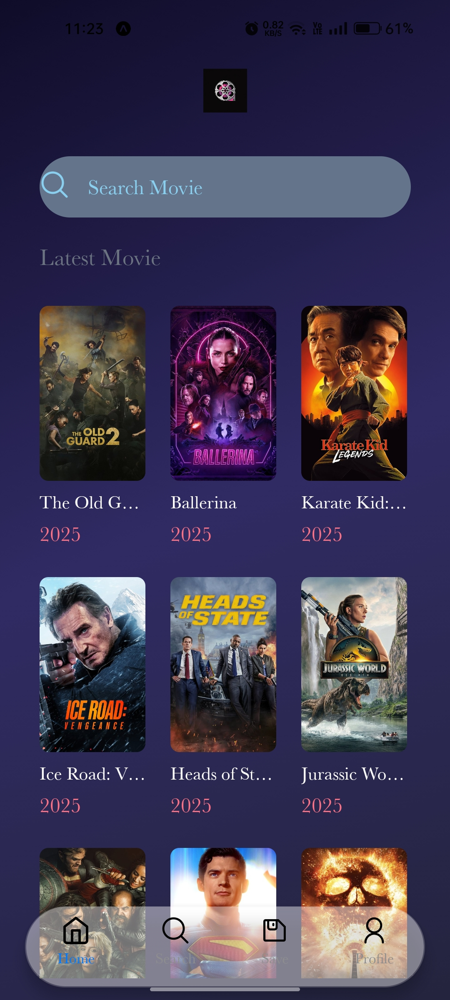
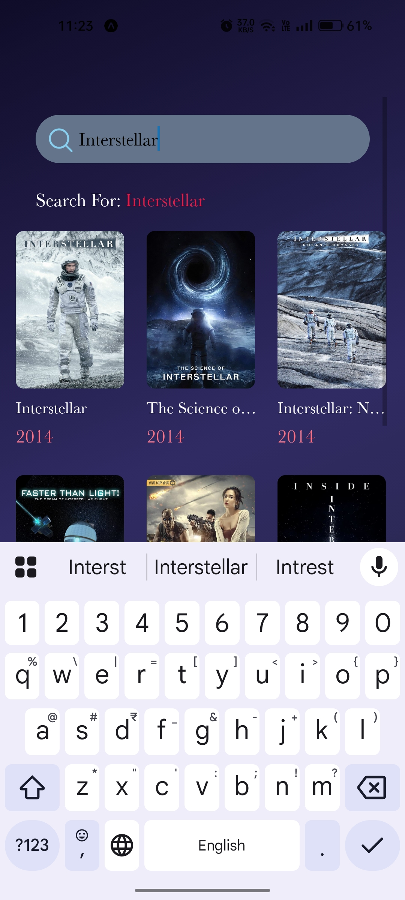
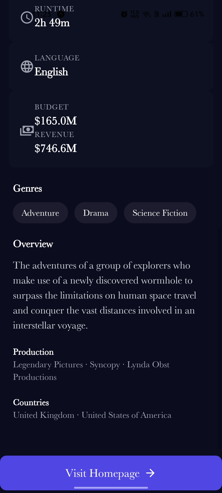

# 🎬 Movies App

A sleek, mobile-first movies application built with **Expo** and styled using **NativeWind**. This app fetches the latest movies, allows users to search their favorite titles, and view detailed movie information — all in a smooth, minimalistic UI.

---

## ✨ Features

- 🔥 **Latest Movies Page**  
  Browse trending and newly released movies with poster thumbnails and quick info.

- 🔍 **Search Page**  
  Instantly search for movies by title with dynamic filtering.

- 🎞️ **Movie Detail Page**  
  Dive into detailed information: synopsis, release date, ratings, cast, and more.

- 💅 **Tailwind Styling with NativeWind**  
  Rapid styling using Tailwind CSS classes tailored for React Native.

---

## 🚀 Tech Stack

- [**Expo**](https://expo.dev/) – for fast, cross-platform mobile development  
- [**React Native**](https://reactnative.dev/) – for building native apps using React  
- [**NativeWind**](https://www.nativewind.dev/) – Tailwind CSS styling in React Native  
- [**TMDB API**](https://www.themoviedb.org/documentation/api) – to fetch movie data (assumed)

---

## 📸 Screenshots

### 🔥 Latest Movies Page



### 🔍 Search Page


### 🎞️ Movie Detail Page



---

## 📦 Installation

```bash
# Clone the repository
git clone https://github.com/your-username/movies-app.git
cd movies-app

# Install dependencies
npm install

# Start the Expo development server
npx expo start
